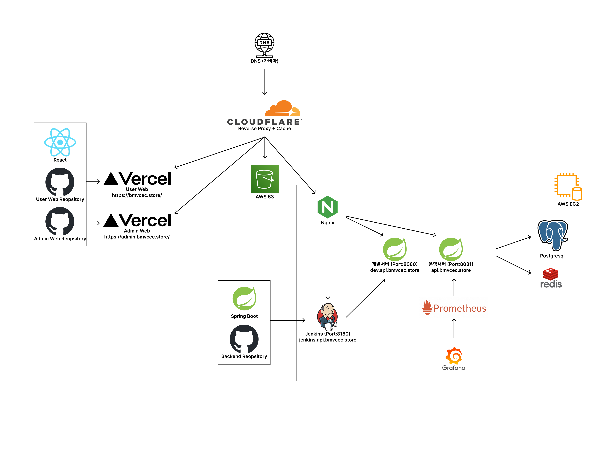

## CEC 프로젝트 백엔드 레포지토리

### 벡엔드 기술스택

프레임워크 / 라이브러리 : Spring Boot / JPA / QueryDSL

배포 자동화 : Jenkins

서버 모니터링 : Prometheus, Grafana

DB : PostgreSQL, Redis

테스트 : JUnit5

리버스 프록시, CORS 설정, SSL 설정 : CLOUDFLARE

### 시스템 아키텍처 구성도

### [개발자 참고 문서](docs/dev-docs.md)